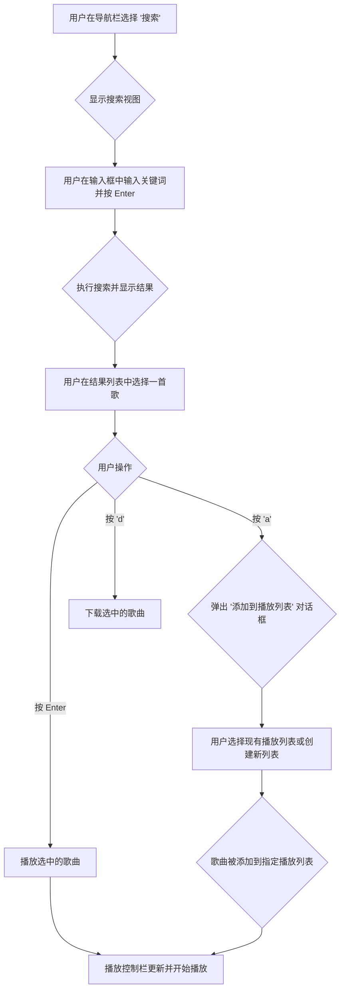

# Music Tools TUI Redesign

## 1. 设计目标

本次 TUI 重新设计旨在实现以下目标：

*   **现代化外观**: 引入更美观、更简洁的界面布局。
*   **直观导航**: 用户可以轻松地在不同功能区（如媒体库、播放列表、搜索、设置）之间切换。
*   **增强的用户体验**: 优化核心交互，如播放控制、歌曲管理和信息展示。
*   **可扩展性**: 设计应易于未来添加新功能。

## 2. 核心布局

新的 TUI 将采用一个三栏式布局，灵感来自于现代桌面音乐播放器。

```
+--------------------------------+----------------------------------------------+
|                                |                                              |
|  Navigation                    |  Main Content Area                           |
|  - Now Playing                 |  (Displays selected view:                    |
|  - Search                      |   - Now Playing Details                      |
|  - Library                     |   - Search Results                           |
|  - Playlists                   |   - Playlist Songs                           |
|                                |   - Library View)                            |
|                                |                                              |
|                                |                                              |
|                                |                                              |
+--------------------------------+----------------------------------------------+
| Playback Control Bar (Global)                                                 |
| [Play/Pause] [Prev] [Next] [Progress Bar] [Volume] [Song Title - Artist]      |
+-------------------------------------------------------------------------------+
```

*   **左侧导航栏 (Navigation)**: 一个固定的垂直面板，用于在主要视图之间切换。
*   **主内容区 (Main Content Area)**: 显示当前活动视图的内容。
*   **底部播放控制栏 (Playback Control Bar)**: 全局可见，始终显示当前播放状态和控制选项。

## 3. 组件设计

### 3.1. 导航栏 (Navigation Pane)

一个使用 `Tree` 控件的静态窗格，提供清晰的导航层次。

*   **控件**: `textual.widgets.Tree`
*   **结构**:
    *   `首页` (默认视图)
    *   `搜索`
    *   `媒体库`
        *   `所有歌曲`
        *   `艺术家`
        *   `专辑`
    *   `播放列表`
        *   (动态加载的用户播放列表)

### 3.2. 正在播放 (Now Playing View)

这是默认的主视图，显示当前歌曲的详细信息。

*   **布局**:
    *   **专辑封面**: 如果可用，显示 ASCII 艺术或图像。
    *   **歌曲信息**: 标题、艺术家、专辑。
    *   **歌词**: 可选的、可滚动的歌词显示区域。通过快捷键 (例如 `l`) 切换显示/隐藏。

### 3.3. 搜索视图 (Search View)

用于在线搜索音乐。

*   **控件**:
    *   `Input` 用于输入搜索词。
    *   `DataTable` 用于显示搜索结果。
*   **列**: `标题`, `艺术家`, `专辑`, `时长`, `来源`
*   **交互**:
    *   `Enter`: 播放选中的歌曲。
    *   `a`: 将选中的歌曲添加到播放列表（弹出对话框）。
    *   `d`: 下载选中的歌曲。

### 3.4. 媒体库 (Library View)

显示本地音乐收藏。

*   **控件**: `DataTable`
*   **视图**:
    *   **所有歌曲**: 显示所有本地歌曲。
    *   **艺术家/专辑**: 分组显示。
*   **列**: `标题`, `艺术家`, `专辑`, `时长`

### 3.5. 播放列表视图 (Playlists View)

显示和管理用户的播放列表。

*   **主视图**: `DataTable`，显示所选播放列表中的歌曲。
*   **交互**:
    *   `Enter`: 播放选中的歌曲。
    *   `Delete`: 从播放列表中移除歌曲。
    *   `Ctrl+R`: 重命名播放列表。

### 3.6. 播放控制栏 (Playback Control Bar)

一个位于屏幕底部的 `Static` 小部件，始终可见。

*   **内容**:
    *   播放/暂停、上一首/下一首按钮。
    *   显示歌曲进度的 `ProgressBar`。
    *   音量控制滑块。
    *   当前播放的歌曲标题和艺术家。

## 4. 用户工作流程

### 4.1. 启动与默认视图

1.  应用启动。
2.  默认显示 **“正在播放”** 视图。
3.  如果播放队列为空，则显示欢迎信息或提示。
4.  用户可以通过左侧导航栏切换到其他视图。

### 4.2. 搜索、播放与添加到播放列表

这是一个核心工作流程，我将使用 Mermaid 流程图来说明。



### 4.3. 播放列表管理

1.  用户在导航栏的“播放列表”下选择一个播放列表。
2.  主内容区显示该播放列表中的所有歌曲。
3.  用户可以：
    *   按 `Enter` 播放选中的歌曲。
    *   按 `Delete` 将选中的歌曲从播放列表中移除。